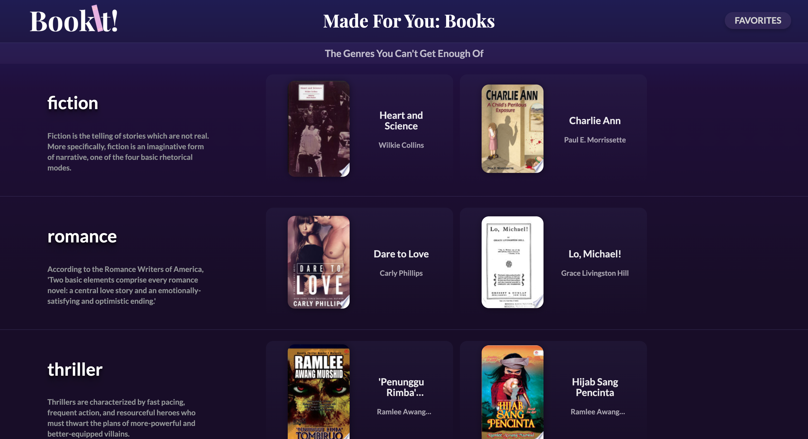

# 📚 BookIt!

**Demo Day Project**
I built an application called BookIt which gives readers just what they need for a personalized reading experience. Have you ever finished reading a really great book and didn’t know what to choose next? Or did you ever want to explore a new genre but didn’t know where to start? BookIt knows your preferences based on your social interactions and past reading options that then provides you with options you may have never considered.

**Pages in Order:**
1. index.ejs
2. signup.ejs
3. interest.ejs
4. profile.ejs
5. bookpage.ejs

**API's:**
- Will be using Google Books API to include data that will align with the suggestions the application will provide.

### Development:
**Languages Used:** HTML & CSS, JavaScript, Node.js, MongoDB

### Optimizations:
Need to finish the final edits to each page & connect API
